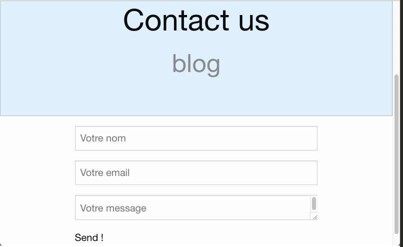

# Project Title
>Short blurb about what your product does.
One Paragraph of project description goes here

## Table of Contents

* [About the Project](#about-the-project)
  * [Built With](#built-with)
* [Getting Started](#getting-started)
  * [Prerequisites](#prerequisites)
  * [Installation](#installation)
* [Usage](#usage)
* [Contributing](#contributing)
* [License](#license)
* [Contact](#contact)
* [Acknowledgements](#acknowledgements)

## Getting Started

These instructions will get you a copy of the project up and running on your local machine for development and testing purposes. See deployment for notes on how to deploy the project on a live system.

### Prerequisites

What things you need to install the software and how to install them

```
Give examples
```

### Installing

A step by step series of examples that tell you how to get a development env running

Say what the step will be

```
Give the example
```

And repeat

```
until finished
```

End with an example of getting some data out of the system or using it for a little demo

## Running the tests

Explain how to run the automated tests for this system

### Break down into end to end tests

Explain what these tests test and why

```
Give an example
```

### And coding style tests

Explain what these tests test and why

```
Give an example
```

## Deployment

Add additional notes about how to deploy this on a live system

## Built With

* [Dropwizard](http://www.dropwizard.io/1.0.2/docs/) - The web framework used
* [Maven](https://maven.apache.org/) - Dependency Management
* [ROME](https://rometools.github.io/rome/) - Used to generate RSS Feeds

## Contributing

Please read [CONTRIBUTING.md](https://gist.github.com/PurpleBooth/b24679402957c63ec426) for details on our code of conduct, and the process for submitting pull requests to us.

## Versioning

We use [SemVer](http://semver.org/) for versioning. For the versions available, see the [tags on this repository](https://github.com/your/project/tags). 

## Authors

* **Billie Thompson** - *Initial work* - [PurpleBooth](https://github.com/PurpleBooth)

See also the list of [contributors](https://github.com/your/project/contributors) who participated in this project.

## License

This project is licensed under the MIT License - see the [LICENSE.md](LICENSE.md) file for details

## Acknowledgments

* Hat tip to anyone whose code was used
* Inspiration
* etc




*Create laravel project :* 
`laravel new Tp2_blog`

*Initialized git repository* 
`git init` 

*add every file to the repository* 
`git add .` 

*See what git's gonna do*
`git status`

*each commit is a point the history of the code repository.*
`git commit -m 'initial commit'`

*shows the history of the code repository* 
`git log`

*git commit --amend modify the latest commit*
`git commit --amend`

*git checkout copy commit hash to return to that point in code*
`git checkout hash`

*to upload to github first create repository and then:*
`git remote add origin https://github.com/salgadox/Tp2_blog.git`

*force it*
`git push -f`

*to uploade normally :*
`git push`

*1.1. first route already made with function "@index",*


* 	2.1. create first layout (main.blade.php)
	2.2. change content inside views: ex...* 
	`@section('title', 'about us'), <title>@yield('title', 'Laravel')</title>`
	2.3.Already have a menu:  Home / Articles / Contact (two new views: aticles.blade.php & contact-blade.php) with controlers in web
	`Route::get('/contact', 'HomeController@contact');
	Route::get('/articles', 'HomeController@articles');`*

* 3 
Create sqlite file: tp2_BD.sqlite (create new file named it and put the .sqlite at the end :)) 

int the .env file
DB_CONNECTION=sqlite
DB_HOST=127.0.0.1
DB_PORT=8001
DB_DATABASE=/Users/xsal/code/Tp2_blog/db.sqlite
#DB_USERNAME=homestead
#DB_PASSWORD=secret

DB_HOST 8001 is the one that I use in my laptop. You can change it if you use another. 
DB_DATABASE= UserPATH to get to the sqlite file

to migrate : 
`php artisan migrate`

then create two tables: "post" & "contact" 
`php artisan make:migration create_contact_table --create=contact`
`php artisan make:migration create_post_table --create=post`

Create One seeder for test : 
`php artisan make:seeder UsersTableSeeder`

Copy this text inside the run function it and decomment line 14 from /database/seeds/DatabaseSeeder.php/

`public function run()
    {
          DB::table('users')->insert([
            'name' => Str::random(10),
            'email' => Str::random(10).'@gmail.com',
            'password' => bcrypt('secret'),
        ]);
    }`

To see all the changes in the db file : 
`php artisan migrate:fresh --seed`
*

*Eloquent
made Post & Contact models*
`php artisan make:model Post
php artisan make:model Contact`
*We have to create a model for each table that he does*

*Complete tables (post and contact)*

*DEBUGED Change post table to posts table and contact table to contacts. now I can acces the data base.*

*Seeded posts and users, as well as shows the all the post title in the main page.*

*TODO EXO 4. show only the 3 lastest posts*

*TODO EXO 5. afficher l'author*


