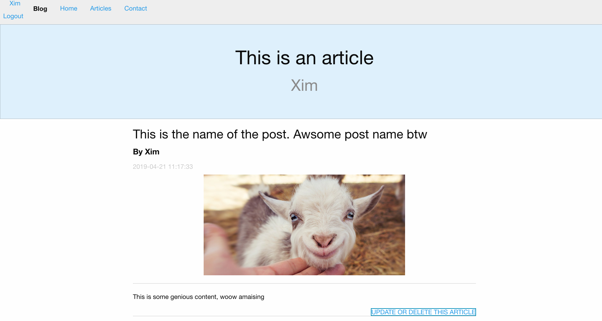
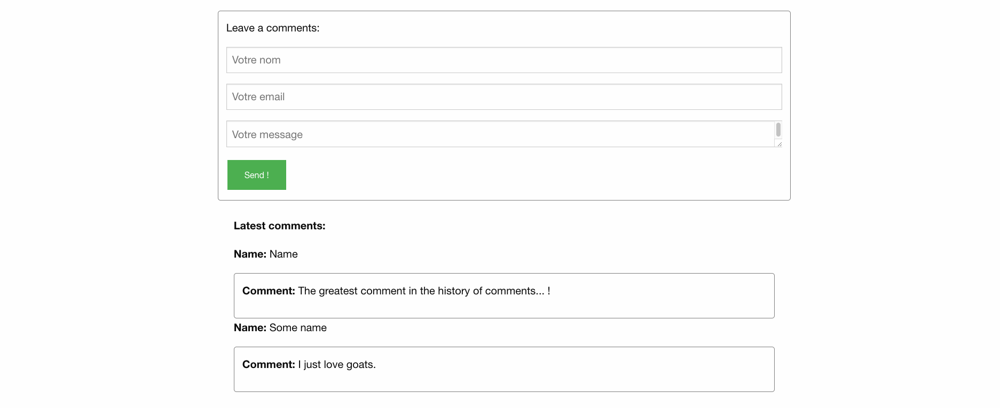
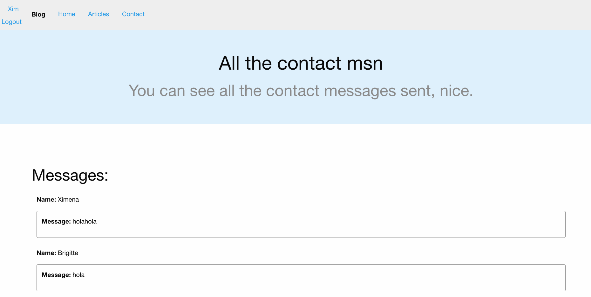

# "Projet de création d’une application web avec le framework PHP Laravel"
>This project is presented as my "programmation web côté serveur" final projet. It is the result of one semestrer studing laravel and php. 




## Table of Contents

* [About the Project](#about-the-project)
  * [Built With](#built-with)
* [Getting Started](#getting-started)
  * [Prerequisites](#prerequisites)
  * [Installing](#Installing)
* [Usage](#usage)
    * [About the roles](#About-the-roles)
    * [Running the tests](#Running-the-tests)
* [Author](#Author)
* [Acknowledgements](#acknowledgements)
* [ScreenShots](#ScreenShots)

## About the Project 
This project contains : 
1. Functionnal and completed version of TP2
2. All the project submitted in Github
3. A nice README.md file 
4. Functionnal commentaries system 
5. CRUD 
6. Identification and Authorisation 
7. Two roles: User and Administrator 
8. Media content.  

### Built With
* [Laravel](https://laravel.com/)  - The web framework used
Laravel Installer 2.0.1 

## Getting Started

### Prerequisites

Verify your computer have Laravel 
```
laravel --version
```

If this is not the case you should installed it. you can follow this link that would help you do it : https://laracasts.com/series/laravel-from-scratch-2018/episodes/2 


### Installing

-Download Zip and unzipped it. 
-Mv it to a repertory where you have laravel install. 
-Install composer : `composer install`
-Copy the .env.example file to a .en file `cp .env.example .env`
-Generate Key : `php artisan key:generate`
-Create a tp2_BD.sqlite file `touch tp2_BD` 
-Go to .env file and change the following : 
```
>DB_CONNECTION=sqlite
DB_HOST=127.0.0.1
>DB_PORT=8001
>DB_DATABASE=/Users/xsal/code/Tp2_blog-cppy/tp2_BD.sqlite #this is my path, change it to your file path._ 
> #DB_USERNAME=homestead 
> #DB_PASSWORD=secret 
```
-Do the migrations `php artisan migrate --seed`
-And finally `php artisan serve`

Once everything is functionning, you'll be able to see the blog in your localhost/Port.


##Usage
To enter the blog you have to be authentificted. 
You can either create your own user going though the registration process or you can log in with this id users: 

Mail | Password | Role |
Xim@xim.com| holahola | Administrator | 
hongo.salado@gmail.com| holahola | user |
brigite@vincent.com| holahola | user |
Salgado@mail.com| holahola | user |

###About the roles
All users have a role. By default each user will have a 'user role'. 
If you may want to change this role you should go to 
Tp2_blog/app/Http/AuthServiceProvider.php 
and change the administrator id to the id from the desired user.  
 ```
public function boot(Gate $gate)
    {
        $this->registerPolicies();

        $gate->before(function ($user) {
            return $user->id == 13; // this is an admin id. 
        });
    }
```

Every user can see the 3 latest posts (from anyone) in the home page (welcome page) and can see their all their own post on the article page. 
They can all send messages, comment, create their own articles, delete them or update them. They cannot delete nor update any post that wasn't created by them. 
The administrator is the only person with sufficient power to delete or update any post he/she wishes. 


### Running the tests

Feel free to explore this blog, to create now post, delete them, leave comments, send messages though the contact us page, update or delete the post... 


## Author

* **Salgado Ximena** - *Initial work* - 

## Acknowledgements

* Hat tip to anyone whose code was used (like W3school, stackoverflow...), 
* Laracast for the tutorials
* Nice coffee lady that sold me coffe during all the working weekends. 


## ScreenShots
login page

registrate page

Welcome page

Articles page

Article page

Comments page

Update/Delete page

Contact Us page

All The Contact Messages page

PermisionWithAdmin page

NoPermissionUser page


